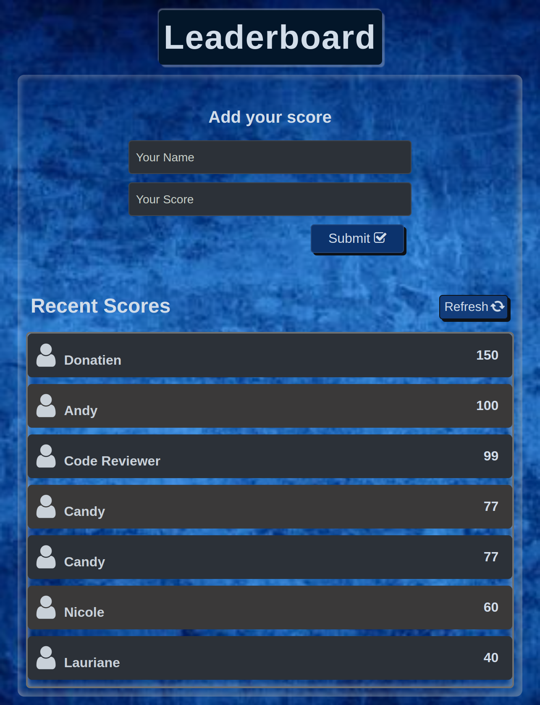
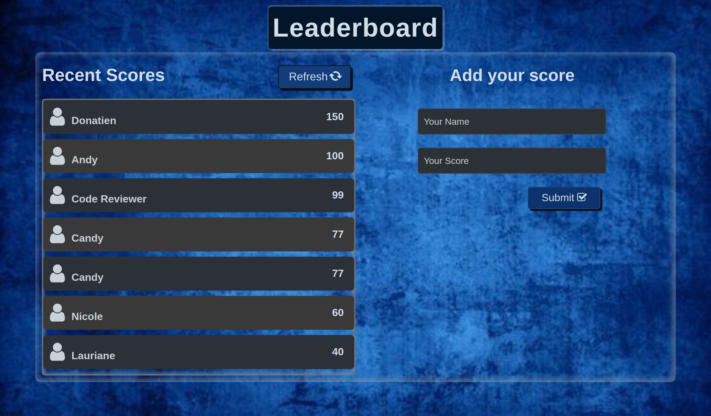

# Leaderboard

## Description

> The leaderboard website displays scores submitted by different players. It also allows you to submit your score. All data is preserved thanks to the external Leaderboard API service.

- This is the page view:

> |     | Mobile version                          | Desktop version                          |     |
> | --- | --------------------------------------- | ---------------------------------------- | --- |
> |     |  |  |

## Built With

- HTML
- SCSS
- JavaScript

## Get Started

To get a local copy up and running follow these simple example steps.

1. Clone the Repo or Download the Zip file or `git@github.com:UsamaMasood12/Leaderboard.git`.
2. `cd /leaderboard`
3. Open it with the live server

## Test

For tracking linter errors locally you need to follow these steps:

After cloning the project you need to run these commands

`npm install` `This command will download all the dependancies of the project`

For tracking linter errors in HTML files run:

`npx hint .`

For tracking linter errors in CSS or SASS files run:

`npx stylelint "**/*.{css,scss}`

And For tracking linter errors in JavaScript files run:

`npx eslint .`

## Live Demo

See the live by clicking [Live Demo Link](https://usamamasood12.github.io/Leaderboard/dist/)

## Author

👤 **Cynthia Inga**

- GitHub: [@UsamaMasood12](https://github.com/UsamaMasood12)
- Twitter: [@Usama__Masood](https://twitter.com/Usama__Masood)
- LinkedIn: [usama-masood](https://www.linkedin.com/in/usama-masood-b4a35014b/)

## 🤝 Contributing

Contributions, issues, and feature requests are welcome!

Feel free to check the [issues page](../../issues/).

## Show your support

Give a ⭐️ if you like this project!

## Acknowledgments

- Thanks to everyone who will get time to check this code and sugest any [issue](https://github.com/UsamaMasood12/Leaderboard/issues) to improve the page.
- Hat tip to [Microvers](www.microverse.org) and all the staff
- Thanks to My coding Partners
- Thanks to My Morning-session-group and Standup-team Partners and
- Thanks to Code Reviewers

## 📝 License

This project is [MIT](./MIT.md) licensed.
